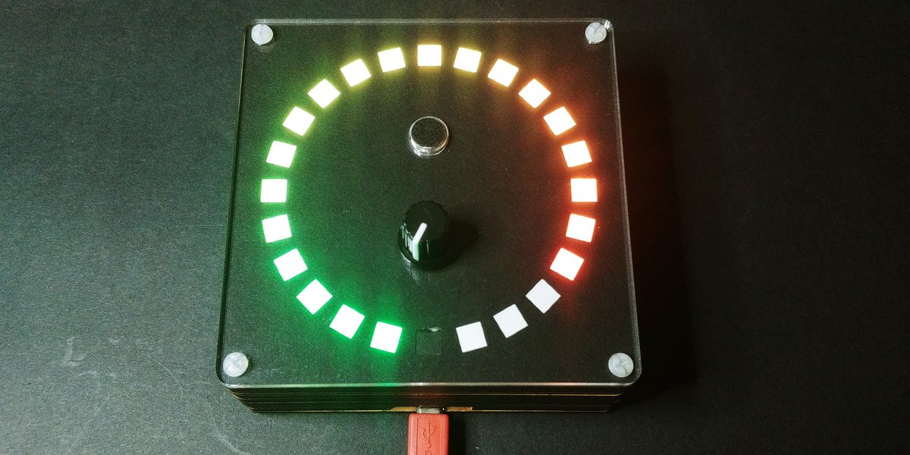
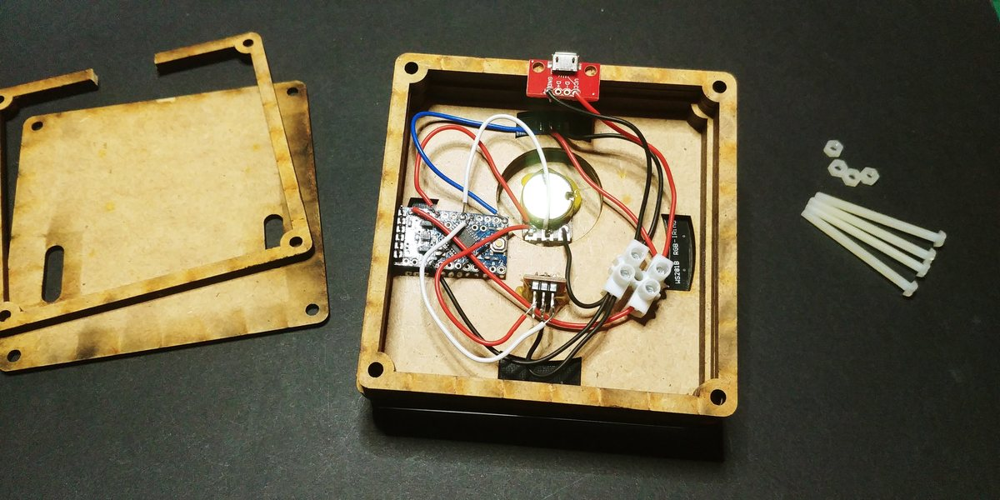
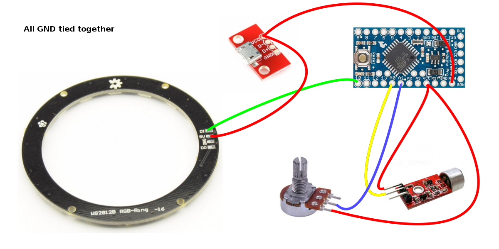
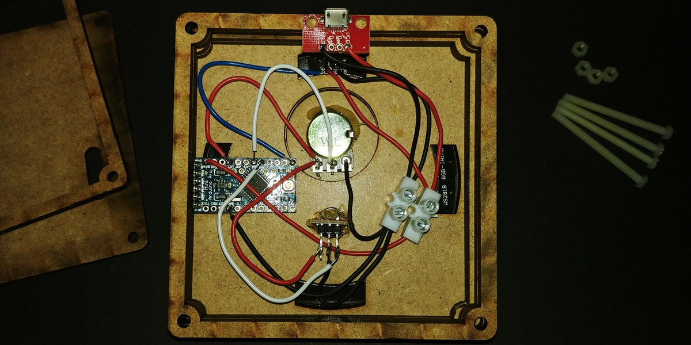

# Sonometer

This is a simple sonometer based on Arduino. It uses an electret mic with analog output to read the environment noise.
A potentiometer to set the sensitivity and a 24 bits LED ring as a visual display of the noise level.
This sonometer code and case is part of the [Slices project](https://github.com/xoseperez/slices.git).



## Hardware

### The box

The hardware has been designed using [OpenSCad](http://www.openscad.org)
and it's inspired by the [PiBow](https://www.raspberrypi.org/blog/pibow/)
cases for Raspberry Pi. A series of layers forming a sandwich. From top to bottom
the layers are (this is true for beta version):

* front, a transparent acrylic layer cut with a laser cutter
* stencil, a thin black cardboard with the individual LEDs cut out with a laser
* diffusor, a thin white paper sheet
* grid, a thin 2.5mm wood layer to isolate each pixel
* LED matrix, a 24 bits LED ring w/ WS2812B pixels
* LED matrix support in MDF
* MDF hollow layers to allow room for the electronics
* back, a clear acrylic layer or MDF again



### The electronics





## Firmware

The firmware is meant to be burn to an Arduino Minio Pro but is is easily ported to any other similar plarform.

The project is ready to be build using [PlatformIO](http://www.platformio.org).
Please refer to their web page for instructions on how to install the builder.
Once installed:

```bash
> cd code
> platformio run
> platformio run --target upload
```

Library dependencies are automatically managed via PlatformIO Library Manager.
